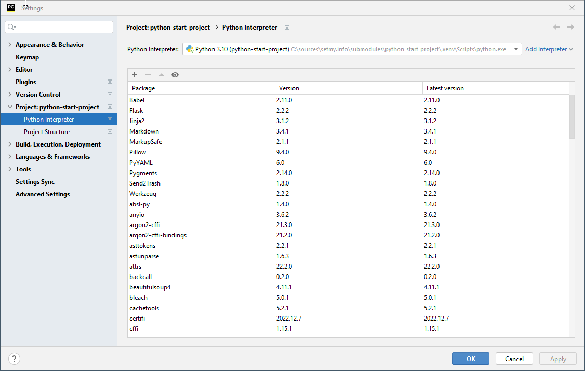

# python-start-project

## Notes

For [Tensorflow 2.11.0 (at the moment the latest version)](https://pypi.org/project/tensorflow/) Python version should
be 3.10.x

Currently, Python 3.9 version (Rocky Linux has that version of Python).

TF table with components versions:

https://www.tensorflow.org/tfx/transform/install

```shell
py -3.9 -m venv ./.venv
.\.venv\Scripts\activate
python --version
python -m pip install --upgrade pip

# Flask etc
pip install click colorama Flask itsdangerous Jinja2 MarkupSafe Markdown PyYAML Werkzeug

# Additional tools Vol 1
pip install jupyterlab notebook voila matplotlib seaborn

# Additional tools Vol 2 (Will be installed by tensorflow installation)
pip install numpy pandas

# Tensorflow
# pyarrow, numpy and pandas will be reinstalled by requirements
pip install tensorboard tensorflow tensorflow-datasets tensorflow-estimator tensorflow-io-gcs-filesystem tensorflow-metadata
# Error
#pip install tensorflow-transform

#PyTorch (CPU version)
pip install torch torchvision torchaudio torchtext

# Take installed software list
pip freeze > requirements.txt
```


Erroro for at **tensorflow-transform** installation (Windows + Python 3.11)

```
Collecting pyarrow<7,>=6 (from tensorflow-transform)
  Using cached pyarrow-6.0.1.tar.gz (770 kB)
  Installing build dependencies ... error
  error: subprocess-exited-with-error

  × pip subprocess to install build dependencies did not run successfully.
  │ exit code: 1
  ╰─> [9 lines of output]
      Ignoring numpy: markers 'python_version < "3.8"' don't match your environment
      Ignoring numpy: markers 'python_version == "3.8"' don't match your environment
      Ignoring numpy: markers 'python_version == "3.9"' don't match your environment
      Collecting cython>=0.29
        Obtaining dependency information for cython>=0.29 from https://files.pythonhosted.org/packages/7d/61/bf165c17a1296fd7db78e18fd8cbb157ab04060ec58d34ff319424af3e2d/Cython-3.0.0-cp311-cp311-win_amd64.whl.metadata
        Using cached Cython-3.0.0-cp311-cp311-win_amd64.whl.metadata (3.2 kB)
      ERROR: Ignored the following versions that require a different python version: 1.21.2 Requires-Python >=3.7,<3.11; 1.21.3 Requires-Python >=3.7,<3.11; 1.21.4 Requires-Python >=3.7,<3.11; 1.21.5 Requires-Python >=3.7,<3.11; 1.21.6 Requires-Python >=3.7,<3.11
      ERROR: Could not find a version that satisfies the requirement numpy==1.21.3 (from versions: 1.3.0, 1.4.1, 1.5.0, 1.5.1, 1.6.0, 1.6.1, 1.6.2, 1.7.0, 1.7.1, 1.7.2, 1.8.0, 1.8.1, 1.8.2, 1.9.0, 1.9.1, 1.9.2, 1.9.3, 1.10.0.post2, 1.10.1, 1.10.2, 1.10.4, 1.11.0, 1.11.1, 1.11.2, 1.11.3, 1.12.0, 1.12.1, 1.13.0, 1.13.1, 1.13.3, 1.14.0, 1.14.1, 1.14.2, 1.14.3, 1.14.4, 1.14.5, 1.14.6, 1.15.0, 1.15.1, 1.15.2, 1.15.3, 1.15.4, 1.16.0, 1.16.1, 1.16.2, 1.16.3, 1.16.4, 1.16.5, 1.16.6, 1.17.0, 1.17.1, 1.17.2, 1.17.3, 1.17.4, 1.17.5, 1.18.0, 1.18.1, 1.18.2, 1.18.3, 1.18.4, 1.18.5, 1.19.0, 1.19.1, 1.19.2, 1.19.3, 1.19.4, 1.19.5, 1.20.0, 1.20.1, 1.20.2, 1.20.3, 1.21.0, 1.21.1, 1.22.0, 1.22.1, 1.22.2, 1.22.3, 1.22.4, 1.23.0rc1, 1.23.0rc2, 1.23.0rc3, 1.23.0, 1.23.1, 1.23.2, 1.23.3, 1.23.4, 1.23.5, 1.24.0rc1, 1.24.0rc2, 1.24.0, 1.24.1, 1.24.2, 1.24.3, 1.24.4, 1.25.0rc1, 1.25.0, 1.25.1, 1.25.2)
      ERROR: No matching distribution found for numpy==1.21.3
      [end of output]

  note: This error originates from a subprocess, and is likely not a problem with pip.
error: subprocess-exited-with-error

× pip subprocess to install build dependencies did not run successfully.
│ exit code: 1
╰─> See above for output.

note: This error originates from a subprocess, and is likely not a problem with pip.

```

## PyCharm setup

Virtual environment setup:



## TODO

1. Refactor Flask related code (web_app) by layers example code (application, layer_example, log, resources).
2. Falsk app gives an error at startup.
3. Problem: The TensorFlow library was compiled to use AVX instructions, but these aren't available on your machine.
